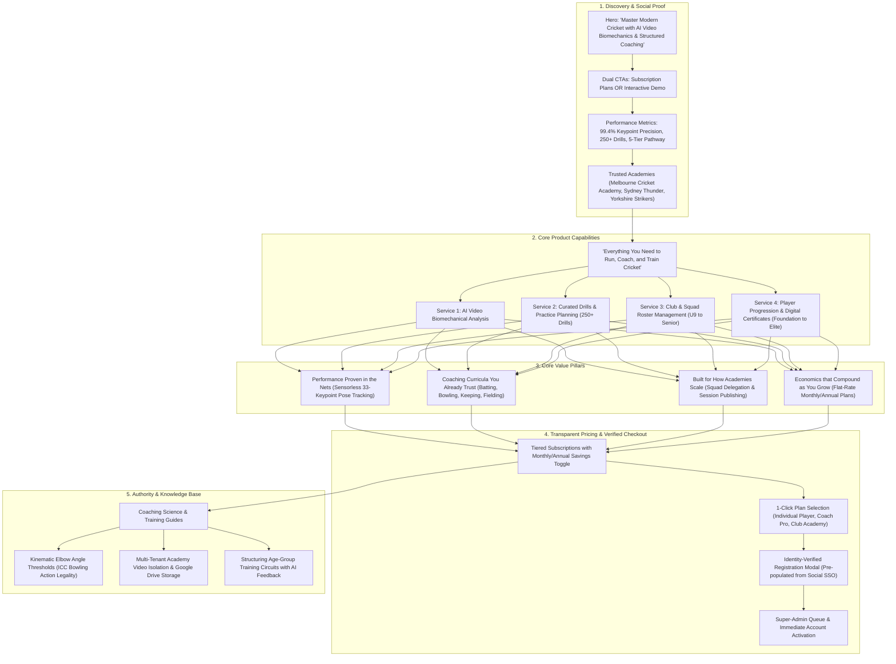

# eCricketCoach Platform User Journey

This document outlines the user journey, core product services, and conversion architecture of **eCricketCoach**—connecting video-based AI biomechanical analysis, curated practice planning, and multi-tenant academy operations.

---

## 1. User Journey Funnel Map

---

## 2. Core Platform Capabilities & Architecture

| Service | Primary Role | Key Features | Benchmark |
|---|---|---|---|
| **AI Video Biomechanics** | Smartphone video pose estimation for technique evaluation | 33-point body landmarking, bowling arm flexion (15° ICC rule), head-over-ball batting balance, weight transfer vectors | `< 2s` Analysis Turnaround |
| **Drills & Practice Planning** | Curated technical drill catalog + custom academy drills | 250+ master drills across Batting, Pace Bowling, Spin, Keeping, and Fielding; proprietary club drill authoring | `250+` Curated Drills |
| **Club & Squad Operations** | Academy management and squad scheduling | Age groups from Under-9 to Senior, 1-click email roster invitations, coach assignment, published session alerts | `100%` Tenant Data Isolation |
| **Skill Progression & Certification** | 5-stage competency framework & verifiable credentials | Foundation → Developing → Intermediate → Advanced → Elite milestones; branded downloadable PDF certificates | `5 Tiers` Standardized Pathway |

---

## 3. Targeted User Personas & Flows

### 1. Individual Player
- **Goal:** Improve personal batting or bowling technique through self-guided practice.
- **Workflow:** Records practice delivery or shot on smartphone → Uploads to AI Biomechanics → Receives kinematic score and prescribed corrective drills → Tracks level milestone progression.

### 2. Private Coach (Coach Pro)
- **Goal:** Manage a client roster of up to 25 players with individualized development plans.
- **Workflow:** Conducts net sessions → Logs post-session observation notes → AI recommends tailored top-up drills → Coach approves drills into player schedule → Issues official achievement certificates upon promotion.

### 3. Club / Academy Administrator (Club Academy)
- **Goal:** Full academy governance across coaches, age-group squads, and parents.
- **Workflow:** Subscribes via social SSO checkout → Super-Admin approves tenancy → Dispatches email invitations to coaches and players → Organizes squads (e.g., U15 Pace, Senior Batting) → Connects Google Drive cloud video archive → Oversees academy progression metrics.
