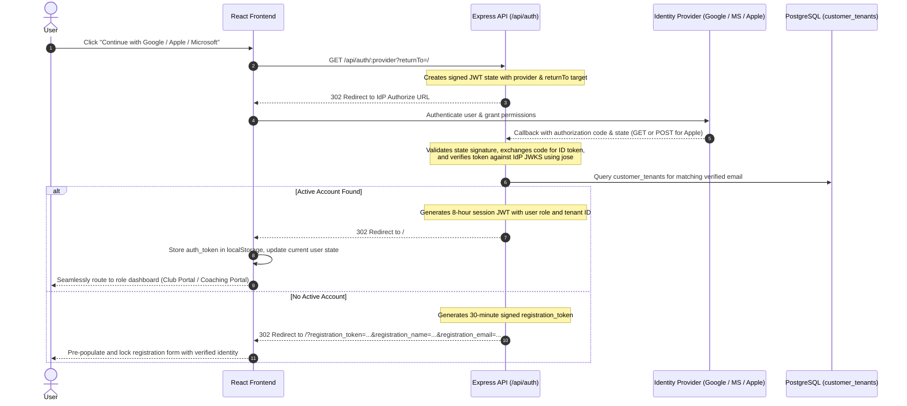
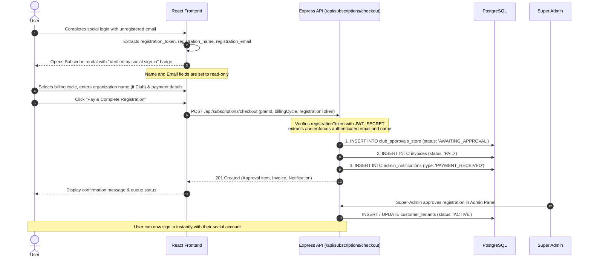

# Authentication & Registration Workflow

This document details the architecture, sequence flows, security model, and configuration for **Federated Social Sign-In (OpenID Connect)** and **Identity-Verified Subscription Registration** in eCricketCoach.

---

## 1. Architectural Overview

The eCricketCoach authentication system relies entirely on standard OpenID Connect (OIDC) identity providers (**Google**, **Apple**, and **Microsoft**). Legacy demo credentials, preset mock logins, and insecure password inputs have been deprecated in favor of cryptographically verified identity tokens.

```mermaid
flowchart TD
    subgraph Client["React SPA Client"]
        A[Login Modal] -->|Select Provider| B[Redirect to /api/auth/:provider]
        C[URL Handler / Auth Listener] -->|Hash with auth_token| D[Store in localStorage & Set Session]
        C -->|Query with registration_token| E[Lock Verified Identity & Open Registration]
    end

    subgraph API["Express Gateway / Microservice"]
        B --> F[Generate Signed JWT State]
        F --> G[Redirect to IdP Authorize URL]
        H[OAuth Callback Handler] -->|Exchange Code| I[Verify ID Token via Remote JWKS]
        I --> J{Check customer_tenants by Email}
        J -->|Active Tenant Found| K[Issue 8h Session JWT & Redirect with Hash]
        J -->|Unregistered / Inactive| L[Issue 30m Registration Grant & Redirect with Query]
        M[Checkout Endpoint] -->|Validate Registration Token| N[Enforce Verified Name & Email]
    end

    subgraph IdP["Identity Providers (OIDC)"]
        G --> O[Google / Apple / Microsoft OAuth Service]
        O -->|Authorization Code| H
    end

    subgraph DB["PostgreSQL Database"]
        J -.-> DB
        N -->|Queue Record| P[club_approvals_store]
        N -->|Record Invoice| Q[invoices]
        N -->|Alert Super Admin| R[admin_notifications]
    end
```

---

## 2. Social Login Sequence

When an active player, coach, or club administrator signs into the platform:



---

## 3. Social Registration & Checkout Sequence

When a new user signs in via a social provider without an existing active subscription, they are automatically transitioned into the registration workflow:



---

## 4. API Endpoints Reference

### `GET /api/auth/providers`
Returns readiness status for configured identity providers.
- **Response**:
  ```json
  {
    "google": true,
    "microsoft": false,
    "apple": false
  }
  ```

### `GET /api/auth/:provider`
Initiates the OIDC authentication flow for the requested provider (`google`, `microsoft`, or `apple`).
- **Query Parameters**:
  - `returnTo` *(optional)*: Workspace route to navigate to after authentication.
- **Behavior**: Generates a signed JWT state token and redirects (302) to the provider's authorization endpoint.

### `GET /api/auth/:provider/callback` & `POST /api/auth/:provider/callback`
Receives the authorization code from the identity provider. Apple callbacks utilize `POST` with `form_post` response mode.
- **Behavior**:
  - Validates `state` signature and matching provider.
  - Exchanges authorization code for provider `id_token`.
  - Cryptographically verifies the token against the provider's public JSON Web Key Set (JWKS).
  - Checks PostgreSQL `customer_tenants` by verified email address.
  - Redirects either with authenticated session tokens (`#auth_token=...`) or verified registration tokens (`?registration_token=...`).

### `POST /api/subscriptions/checkout`
Processes subscription registration and payment.
- **Body Parameters**:
  - `planId`: `'INDIVIDUAL' | 'COACH_PRO' | 'CLUB_ACADEMY'`
  - `billingCycle`: `'MONTHLY' | 'ANNUAL'`
  - `name`: Contact name
  - `email`: Contact email
  - `organizationName`: Club / Academy name (required for Club tier)
  - `cardNumber`: Card number
  - `registrationToken` *(optional)*: Signed social identity grant produced during OIDC callback.

---

## 5. Security & Verification Controls

1. **State CSRF Mitigation**: OAuth state parameters are signed JWTs containing expiration timestamps, target provider, and redirect targets, preventing authorization code injection attacks.
2. **Cryptographic Token Verification**: Identity tokens are verified against upstream provider JWKS using the `jose` library, asserting signature authenticity, audience matching, and valid issuers.
3. **Identity Spoofing Prevention**: When `registrationToken` is provided to `/api/subscriptions/checkout`, the server ignores arbitrary user-supplied name and email parameters, extracting verified claims directly from the cryptographically signed token.
4. **Credential Isolation**: Client applications never touch or store third-party provider access tokens or refresh secrets; only scoped application session JWTs are minted for subsequent API calls.

---

## 6. Provider Configuration Guide

To enable live social login for each provider, set the environment variables in `web-app/.env`:

```env
APP_ORIGIN=http://localhost:3000
JWT_SECRET=your_secure_random_jwt_secret
ADMIN_EMAILS=shahanurreza@gmail.com

# Google Cloud Console (OAuth 2.0 Client IDs)
GOOGLE_CLIENT_ID=your-google-client-id
GOOGLE_CLIENT_SECRET=your-google-client-secret

# Microsoft Azure Portal (App Registrations)
MICROSOFT_CLIENT_ID=your-microsoft-app-id
MICROSOFT_CLIENT_SECRET=your-microsoft-client-secret

# Apple Developer Console (Services IDs)
APPLE_CLIENT_ID=your-apple-service-id
APPLE_CLIENT_SECRET=your-apple-client-secret
```

### Authorized Redirect URIs
Register the following callback URLs in each developer console:
- **Google:** `http://localhost:3000/api/auth/google/callback`
- **Microsoft:** `http://localhost:3000/api/auth/microsoft/callback`
- **Apple:** `http://localhost:3000/api/auth/apple/callback`

For detailed click-by-click instructions on setting up each provider in the Google Cloud Console, Azure Portal, and Apple Developer account, see the full [docs/social-sign-in-setup-guide.md](docs/social-sign-in-setup-guide.md).
