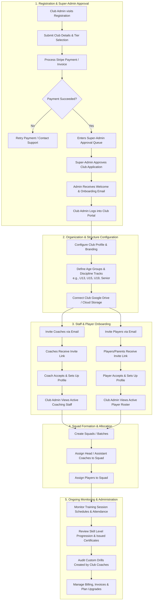
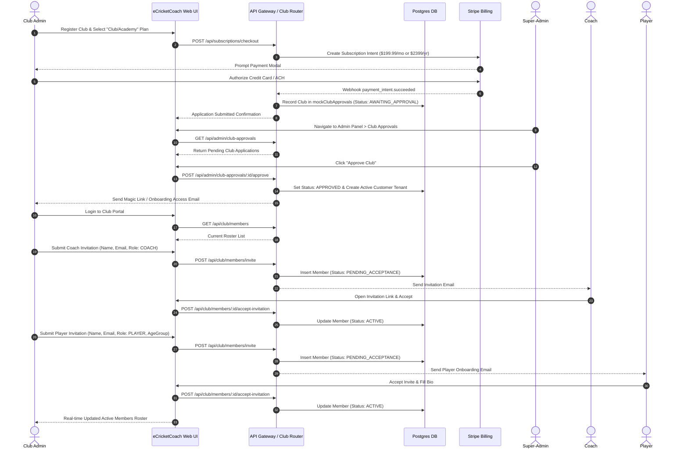
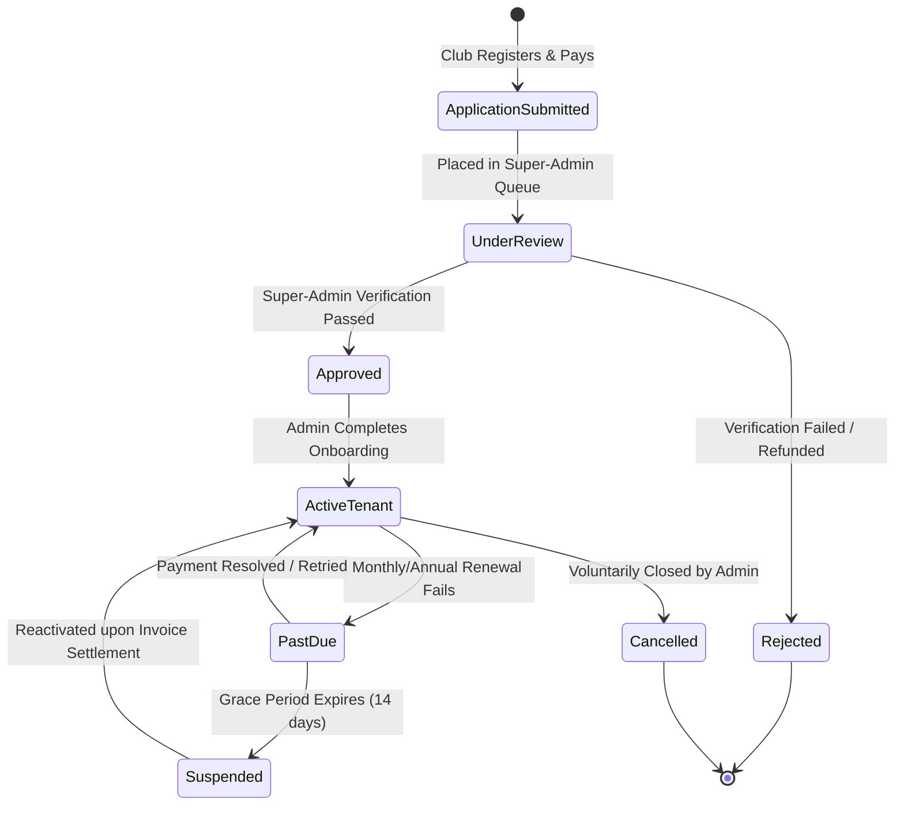

# Club Admin User Flow

This document details the end-to-end journey and lifecycle of a **Club / Academy Administrator** in the eCricketCoach platform, from initial registration and payment through organization setup, roster onboarding, squad delegation, and subscription oversight.

---

## 1. High-Level Flowchart

---

## 2. Sequence Diagram: Club Registration, Approval & Member Invitation

---

## 3. State Machine: Club Tenant Lifecycle

---

## 4. Club Admin Functional Responsibilities Matrix

| Stage | Action | Endpoint / Service | Artifact Generated |
| :--- | :--- | :--- | :--- |
| **1. Registration** | Register club & pay fee | `POST /api/subscriptions/checkout` | Stripe Customer & Invoice record |
| **2. Approval** | Super-Admin approval | `POST /api/admin/club-approvals/:id/approve` | Active Tenant Entry, Tenant ID |
| **3. Staffing** | Invite coaches & staff | `POST /api/club/members/invite` (Role: `COACH`) | Coach Credentials & Permissions |
| **4. Onboarding** | Invite youth/adult players | `POST /api/club/members/invite` (Role: `PLAYER`) | Player Profile & Base Skill Rank |
| **5. Squads** | Create age-group squads | `POST /api/club/squads` | Squad ID, Assigned Coaches & Players |
| **6. Drills Library** | Audit/Approve club drills | `GET /api/drills?source=CLUB_CUSTOM` | Club Drill Catalog |
| **7. Governance** | Review promotion certs | `GET /api/club/certificates` | Official Digital Certificates |
| **8. Billing** | Review monthly invoices | `GET /api/admin/invoices` | Tax Invoices & Receipts |
