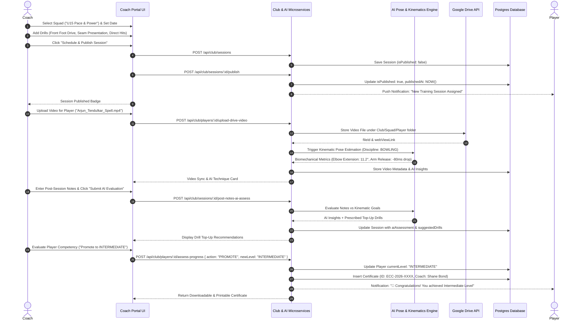
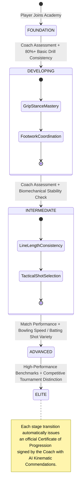

# Coach User Flow

This document details the complete operational lifecycle of a **Cricket Coach** on the eCricketCoach platform, covering squad assignments, training session design, live drill execution, post-session notes with AI assessment, video biomechanics analysis, and player progression certification.

---

## 1. High-Level Flowchart

```mermaid
flowchart TD
    subgraph Onboarding["1. Coach Onboarding & Profile Setup"]
        A[Receive Club Invitation Email] --> B[Click Invitation Link & Accept]
        B --> C[Configure Coaching Profile\ne.g., Disciplines: Batting / Bowling / Keeping / Fielding]
        C --> D[Access Coach Dashboard in Club Portal]
    end

    subgraph SquadPrep["2. Squad & Drill Preparation"]
        D --> E[View Assigned Squads e.g., U15 Pace & Power]
        E --> F[Review System Pre-defined Drills Library]
        F --> G{Custom Drill Needed?}
        G -- Yes --> H[Author Club-Custom Drill\ne.g., MCA Death Overs Yorker Drill]
        G -- No --> I[Select Existing System Drills]
        H --> J[Drill Saved to Club Catalog]
        I & J --> K[Create Structured Training Session]
        K --> L[Publish Session Plan to Squad Players]
    end

    subgraph LiveExecution["3. Session Execution & Media Capture"]
        L --> M[Conduct Net / Field Practice Session]
        M --> N[Capture Video Clips of Player Actions]
        N --> O[Sync Videos to Club Google Drive Folder]
    end

    subgraph PostSessionAI["4. Post-Session Notes & AI Feedback"]
        O --> P[Log Qualitative Coach Post-Session Notes]
        P --> Q[Trigger AI Kinematic & Technique Evaluation]
        Q --> R[Review AI Recommendations & Tailored Drill Top-Ups]
        R --> S[Append Recommended Drills to Squad or Individual Homework]
    end

    subgraph ProgressionCert["5. Player Evaluation & Certification"]
        S --> T[Review Player Historical Metrics & Video History]
        T --> U{Promote Player to Next Stage?}
        U -- No --> V[Consolidate Current Stage Drills]
        U -- Yes --> W[Promote Player e.g., Developing -> Intermediate]
        W --> X[System Generates Cryptographic Digital Certificate]
        X --> Y[Issue Certificate with Coach Signature & AI Commendation]
        Y --> Z[Player & Parents Receive Certificate in App]
    end
```

---

## 2. Sequence Diagram: Session Planning, AI Evaluation & Certification

---

## 3. State Machine: Player Skill Stage Progression (Coach-Driven)

---

## 4. Coach Functional Checklist Matrix

| Workflow Phase | Coach Action | Underlying API Call | Generated Output |
| :--- | :--- | :--- | :--- |
| **Squad Assignment** | View allocated squads & rosters | `GET /api/club/squads` | Active squad member list |
| **Drill Authoring** | Author a proprietary drill | `POST /api/drills/club` | Club Custom Drill item |
| **Session Scheduling** | Build training session agenda | `POST /api/club/sessions` | Structured multi-drill session |
| **Session Publishing** | Notify squad of upcoming drills | `POST /api/club/sessions/:id/publish` | Published session + Player alert |
| **Video Feedback** | Upload practice clip to Google Drive | `POST /api/club/players/:id/upload-drive-video` | Drive URI & Kinematic Scorecard |
| **Post-Session Notes** | Write observations & trigger AI | `POST /api/club/sessions/:id/post-notes-ai-assess` | AI Evaluation & Drill Top-ups |
| **Progression & Award** | Promote player to next tier | `POST /api/club/players/:id/assess-progress` | Digital Certificate (ECC-2026-XXXX) |
